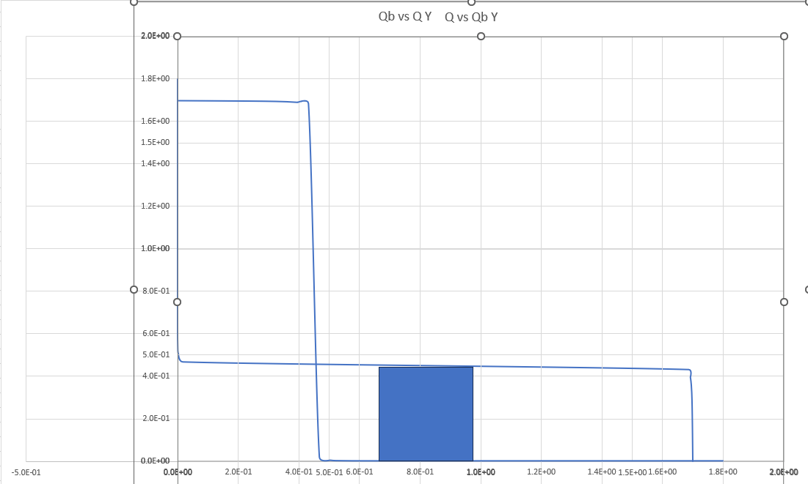
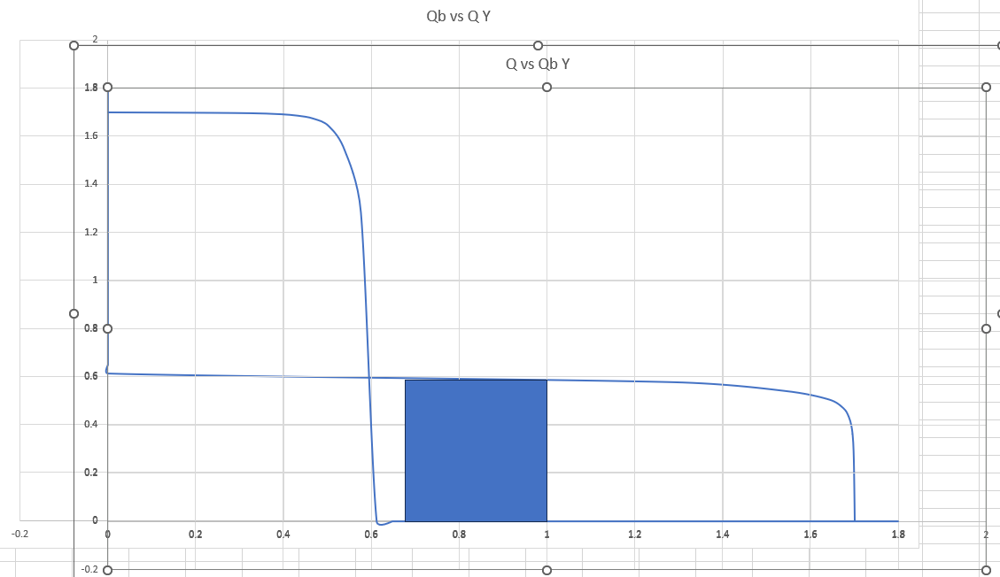
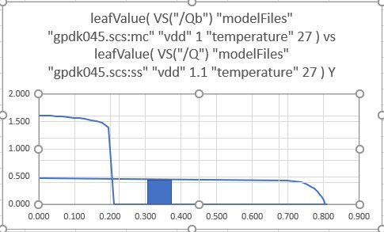

# Schmitt-Trigger Based Low Power SRAM (45-nm CMOS)

This repository documents the design and analysis of an **11T Schmitt-Trigger Based SRAM cell** implemented in **45-nm CMOS technology**.  
The project was developed as part of the **Digital CMOS VLSI Design (VLS 503)** course at IIIT Bangalore.

---

## Project Overview
- Implemented an **11T Schmitt-Trigger SRAM cell** to improve **Static Noise Margin (SNM)** and minimize read disturbance compared to the conventional 6T SRAM cell.  
- Utilized **separate read/write ports** to enhance stability and eliminate read–write coupling issues.  
- Conducted **PVT (Process-Voltage-Temperature) simulations** and **Monte Carlo analysis**, validating robustness under fabrication and environmental variations.  
- Benchmarked against 6T SRAM architecture, achieving **significant energy per bit reduction** and better noise resilience.

---

##  Tech Stack
- **45-nm CMOS PDK**  
- **Cadence Virtuoso** – Schematic/Layout Design  
- **Synopsys HSPICE** – Circuit Simulation & SNM Analysis  
- **Matlab/Python** – Data visualization of simulation results  

*(Note: Design files are hosted on institute systems and cannot be publicly shared. This repo provides the report, results, and documentation.)*

---

## Key Results

### Static Noise Margin (SNM) Comparison
- Conventional **6T SRAM** (baseline):  
    
    

- Proposed **11T Schmitt-Trigger SRAM**:  
    
    
    
    
    

---

### PVT Analysis (Process, Voltage, Temperature Corners)
- Hold SNM across PVT:  
    
    

- Write/Read SNM across PVT:  
    

---

## Repository Contents
- `report/` – Final project report & reference papers  
- `results/` – Plots and tables from simulations  

---

## References
1. Oruga et al., *Schmitt-Trigger Based Low Power SRAM in 45-nm CMOS*, IEEE, 2023.  
2. IIIT Bangalore VLS 503 Project Report (2024).  

---

## Authors  
- Raghav Khurana
- Divyansh Kumar
- Puneet Kalyan Upadrasta  
- Abu Saleh Khan  
- Shruti Singh  
- Keerthana B  

---

